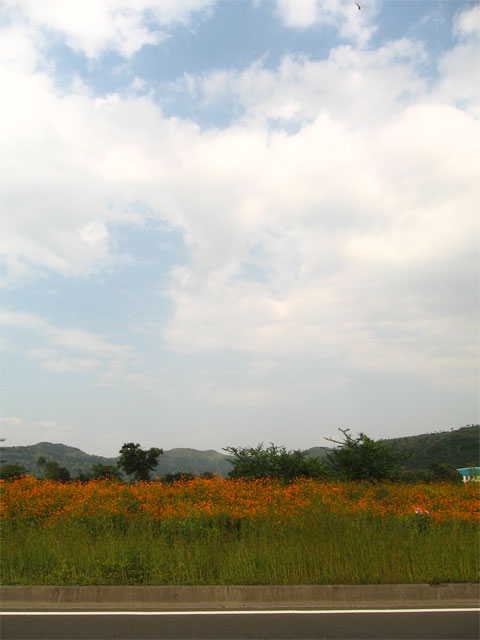
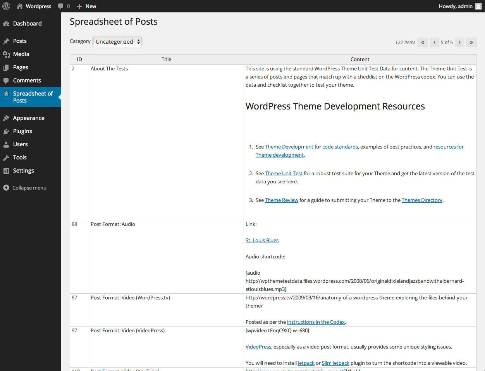

# Image gallery — orientations & dimensions

A test document for mdv's image rendering. Images live alongside this file in `assets/` and
are referenced with **repo-relative paths** (`assets/…`), so the document is self-contained
and also exercises base-directory resolution regardless of the working directory mdv was
launched from. Asset filenames state their test purpose and pixel size. Images render at
their **native pixel size** when they fit, are **scaled down to the column width** when
larger (aspect preserved), and are **never upscaled**; each caption notes the dimensions.

## Inline within a line of text

A tiny 60×60 thumbnail  sits on the text
baseline, and a 175×175 square  flows inline
too — useful for icons and emoji-sized art mixed into prose.

## Square

A 175×175 square. Should render exactly 175 px wide.

## Landscape (small → large)

640×480 — comfortably inside the reading column.

800×600 — standard 4:3.

## Portrait

450×600 — taller than wide.

480×640 — a larger portrait.

## Wide panorama (fit-to-column check)

1280×384 — much wider than the reading column. mdv decodes images with `Stretch="Uniform"`
capped at native size, so a large image **scales down to fit the column width** (preserving
aspect ratio) instead of overflowing, while images smaller than the column stay at native
size and are never upscaled.

## Large PNG

1252×959 PNG — wider than the column, so it scales down to fit.

## Animated GIF (first frame)

175×128 GIF — WPF shows the first frame.

## Images inside a list

- First item with an inline thumbnail 
- Second item, image on its own line below:

  
- Third item, plain text

## Image as a link

The image is wrapped in a link to an external URL (mdv binds the hyperlink command):

## Missing image (graceful failure)

A reference to a file that does not exist should simply render nothing, not crash:

## Path forms — what works

| Path form | Renders? | Notes |
|:--|:-:|:--|
| Relative (`a/b.jpg`, `../b.jpg`) | ✅ | Resolved against this document's directory. |
| `file:///D:/.../b.jpg` | ✅ | Absolute file URI. |
| Bare absolute (`D:/.../b.jpg`) | ❌ | **Markdig.Wpf limitation** — it rejects bare Windows drive paths and substitutes `#`, so the real path never reaches mdv. Use a relative path or a `file://` URI instead. |
| `http(s)://…` | ✅ | Fetched by Markdig directly. |
