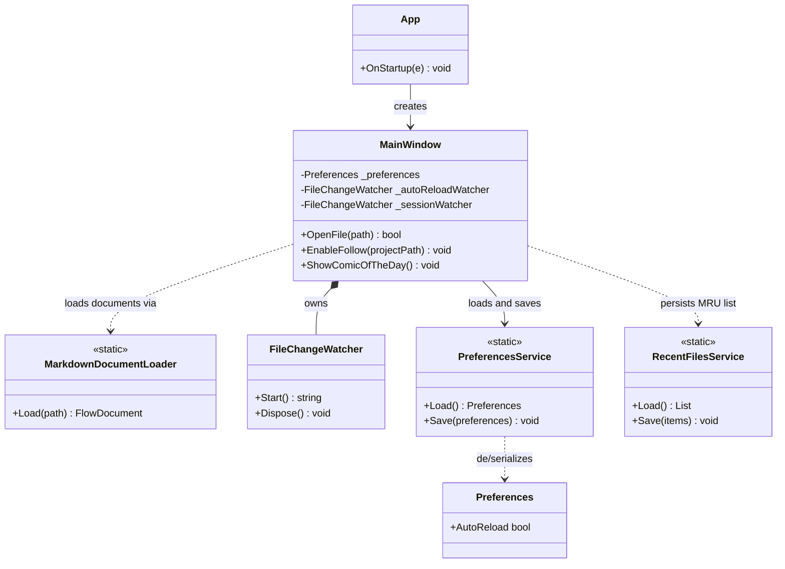
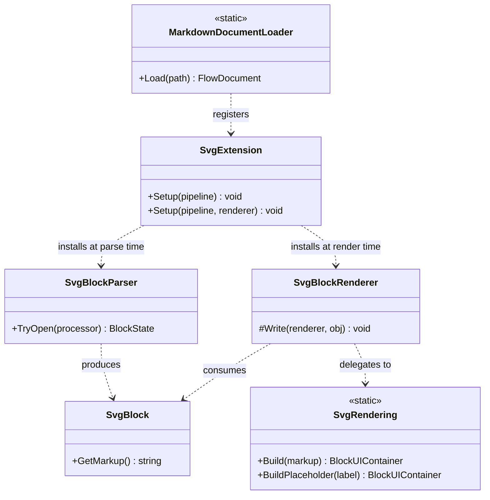
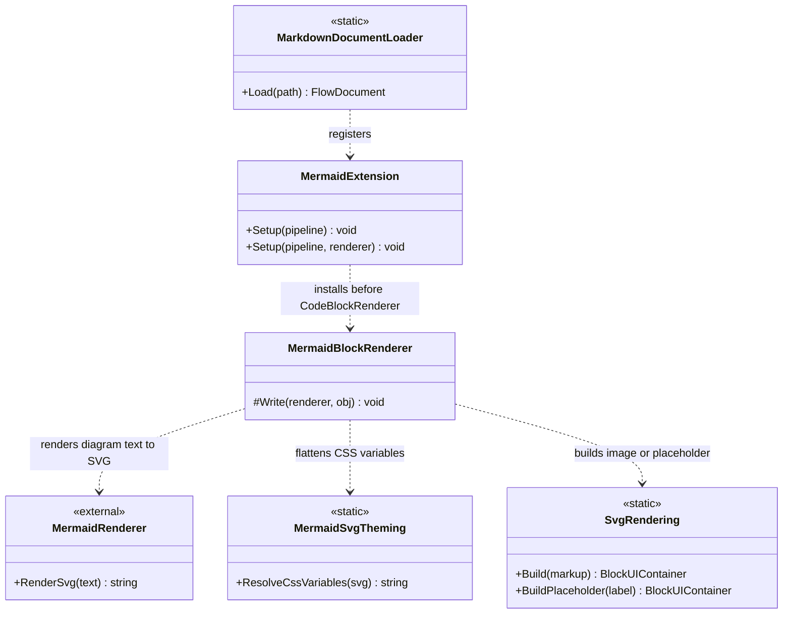
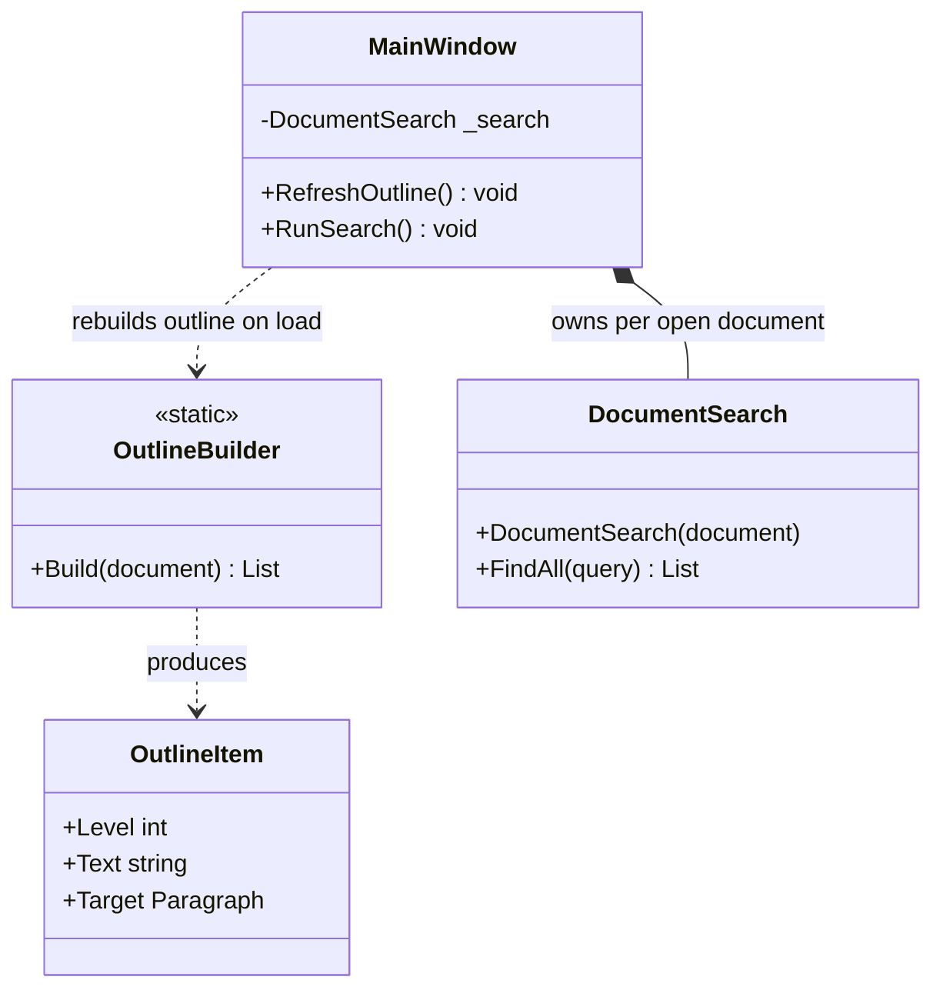
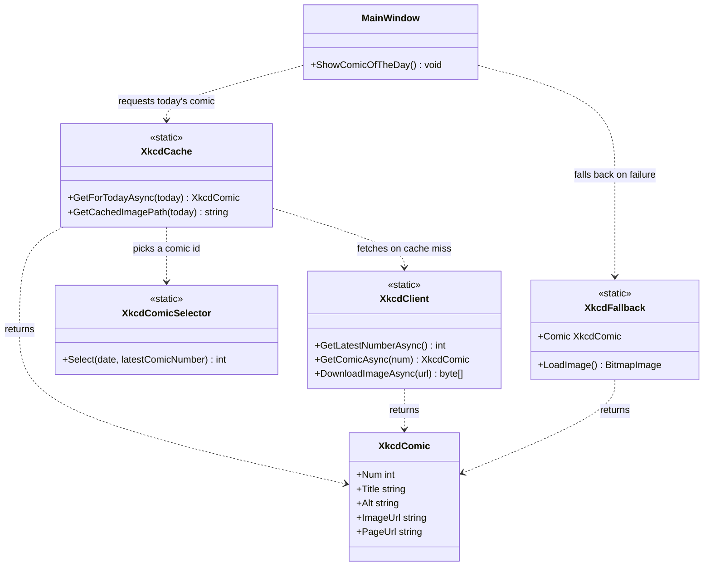
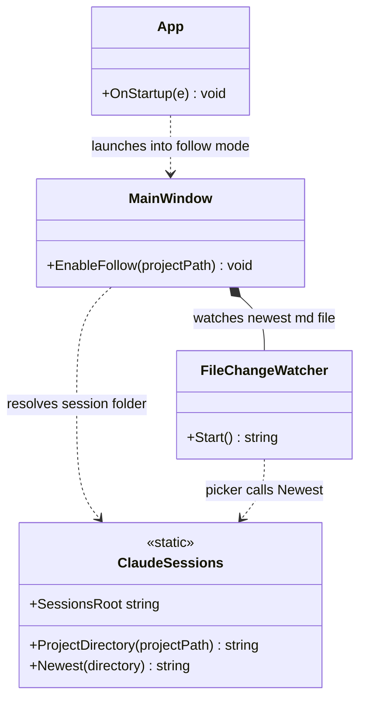

# The Architecture of `mdv`

`mdv` is a WPF Markdown viewer. It renders a Markdown file to a `FlowDocument`
via Markdig, then layers a handful of focused subsystems on top: inline SVG
and Mermaid diagram rendering, document navigation, a Claude Code follow
mode, and a small "comic of the day" easter egg. The diagrams below are
generated straight from the current source under `src/mdv`.

## Application Shell & Document Lifecycle

`App` handles startup (parsing `--follow` and file-path command-line
arguments) and hands off to a single `MainWindow`, which owns the open
document's lifetime end to end. Loading always goes through
`MarkdownDocumentLoader`; two small static services persist state across
runs — the user's `Preferences` (auto-reload on/off) and the recent-files
list — while `FileChangeWatcher` notifies the window when a watched file
changes on disk.



## Inline SVG Rendering

Markdig has no native renderer for a bare `<svg>` block, so `SvgExtension`
plugs in both halves of the fix: `SvgBlockParser` recognizes a whole
`<svg>...</svg>` at parse time (CommonMark's own raw-HTML rules would
truncate it), producing an `SvgBlock`, and `SvgBlockRenderer` draws it by
delegating to `SvgRendering`, a SharpVectors-based helper shared with the
Mermaid pipeline below.



## Mermaid Diagram Rendering

A ` ```mermaid ` fenced code block needs no new parser — Markdig already
produces a `FencedCodeBlock` for it. `MermaidExtension` installs
`MermaidBlockRenderer` ahead of Markdig.Wpf's own code-block renderer;
it renders the block's text through the Mermaider library to SVG, flattens
Mermaider's CSS custom properties with `MermaidSvgTheming` (SharpVectors
can't parse them directly), and then reuses the same `SvgRendering` path
as the inline-SVG feature above.



## Document Navigation

Once a document is loaded, `MainWindow` builds two independent views over
its `FlowDocument`: `OutlineBuilder` walks the rendered headings (matched by
their Markdig.Wpf style keys) into a flat list of `OutlineItem`s for the
sidebar, and `DocumentSearch` flattens the document's text once so the find
bar can locate and scroll to substring matches.



## Comic of the Day

When `mdv` opens with no file argument, `MainWindow` shows a deterministic
daily xkcd comic. `XkcdComicSelector` is a pure function of today's date (a
C# port of a reference Python script) that picks a comic id; `XkcdCache`
resolves that id through `XkcdClient` and caches the result on disk for the
day, falling back to the bundled `XkcdFallback` comic if the network or the
API is unavailable.



## Claude Code Follow Mode

`mdv --follow [project-path]` mirrors a live Claude Code session instead of
opening a fixed file. `ClaudeSessions` knows the slug rule a companion
`Stop` hook uses to write one Markdown file per response into a per-project
folder; `MainWindow` points a `FileChangeWatcher` at that folder with a
picker that always resolves to the newest file, so the view follows
whichever session is currently active.


