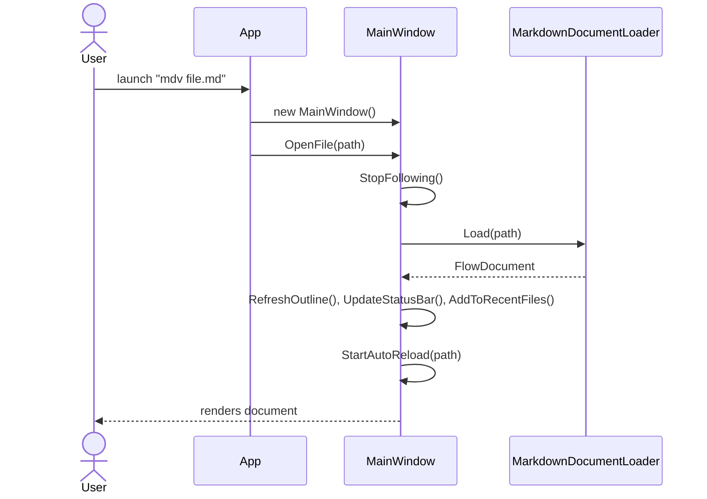
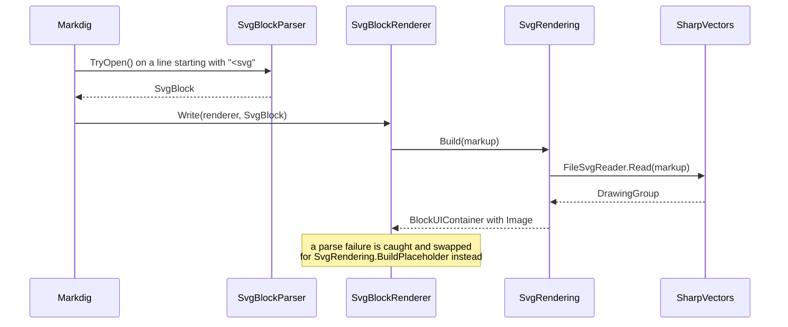
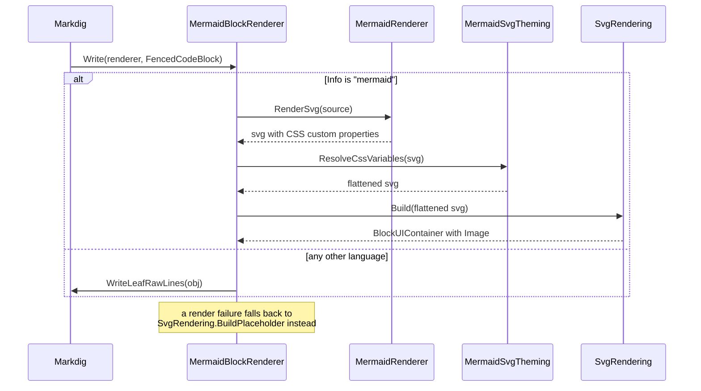
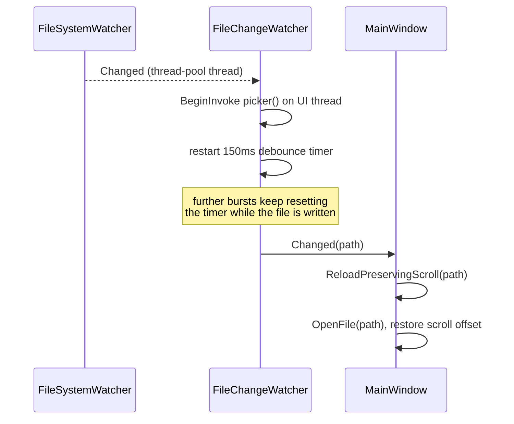
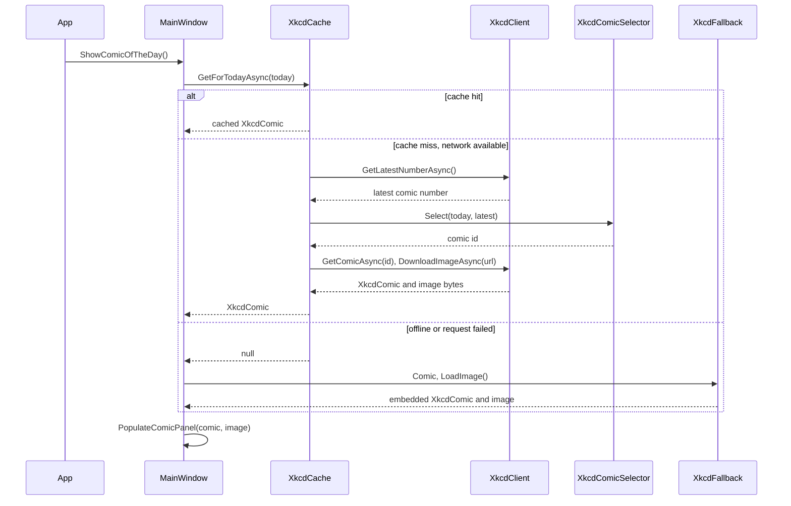
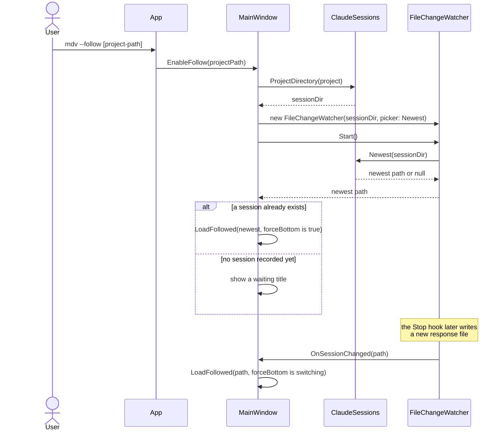

# The Architecture of `mdv`

`mdv` is a WPF Markdown viewer. Where `inline-class-diagram.md` shows the
static shape of its subsystems, this file shows them in motion: the actual
call sequences behind opening a file, rendering inline SVG and Mermaid
diagrams, auto-reloading on a file change, fetching the comic of the day,
and mirroring a live Claude Code session. Every sequence below is
transcribed from the current source under `src/mdv`.

## Opening a File

`App.OnStartup` hands a file path straight to `MainWindow.OpenFile`, which
first leaves follow mode (if it was active) so a queued watcher event can't
clobber the file the user just asked for. Loading always goes through
`MarkdownDocumentLoader`; once the `FlowDocument` comes back, the window
refreshes its outline, status bar, and recent-files list, then repoints
auto-reload at the newly opened file.

## Inline SVG Rendering

Markdig's own raw-HTML rules can truncate a bare `<svg>` block, so
`SvgBlockParser` claims it at parse time instead, producing a whole
`SvgBlock`. At render time `SvgBlockRenderer` hands that block's markup to
`SvgRendering`, which drives SharpVectors to turn it into a `DrawingGroup`
and wraps the result as an `Image`. A parse failure never reaches the
document — it degrades to a placeholder instead.

## Mermaid Diagram Rendering

`MermaidBlockRenderer` sits in front of Markdig.Wpf's own code-block
renderer and branches on the fence's language tag. A `mermaid` fence goes
through the Mermaider library to SVG, then `MermaidSvgTheming` flattens the
CSS custom properties Mermaider emits (SharpVectors can't parse them
as-is) before the result reaches the same `SvgRendering` path used by
inline SVG above. Any other language falls straight through to Markdig.Wpf's
default rendering, unmodified.

## Auto-Reload on File Change

File-system notifications land on a thread-pool thread and can burst while
a file is still being written, so `FileChangeWatcher` marshals each one
onto the UI thread and debounces them behind a 150ms timer. Only once
things go quiet does it report the picker's latest choice, which
`MainWindow` uses to reload the file in place without losing the reader's
scroll position.

## Comic of the Day

With no file argument, `MainWindow` asks `XkcdCache` for today's comic.
A cache hit returns immediately; a miss fetches the latest comic number,
runs it through the deterministic `XkcdComicSelector`, and downloads the
chosen comic and its image. Any failure along that path — offline, a bad
response, whatever — is swallowed, and the bundled `XkcdFallback` comic is
shown instead so the panel is never empty.

## Claude Code Follow Mode

`mdv --follow [project-path]` resolves the project's session folder through
`ClaudeSessions` and points a `FileChangeWatcher` at it, whose picker always
reports the newest `.md` file. If a session already exists, the view jumps
straight to it; otherwise the title shows a waiting state until the
companion `Stop` hook writes the first response, at which point the watcher
fires and the view follows along.

